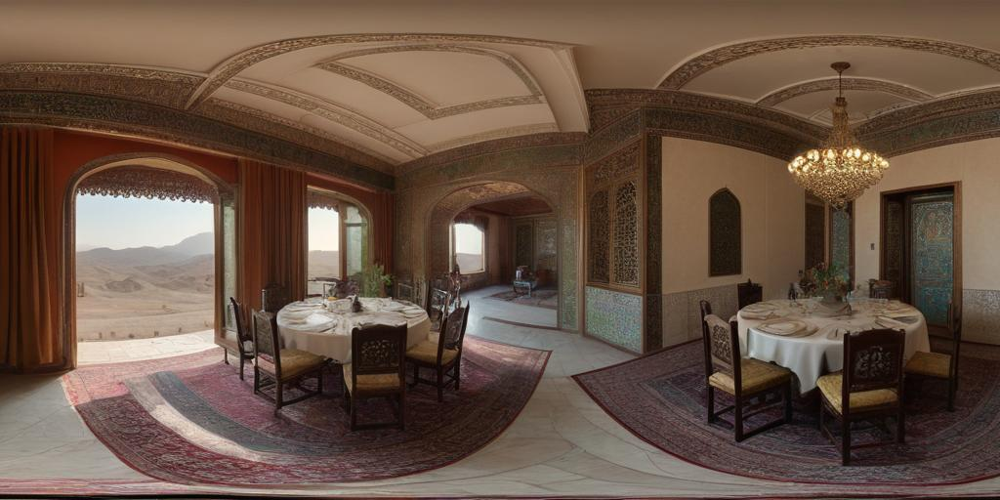
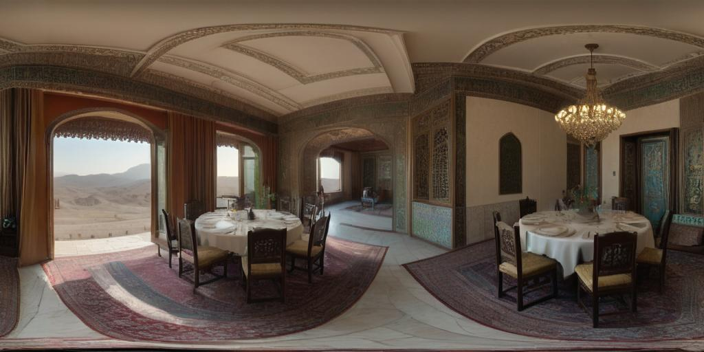
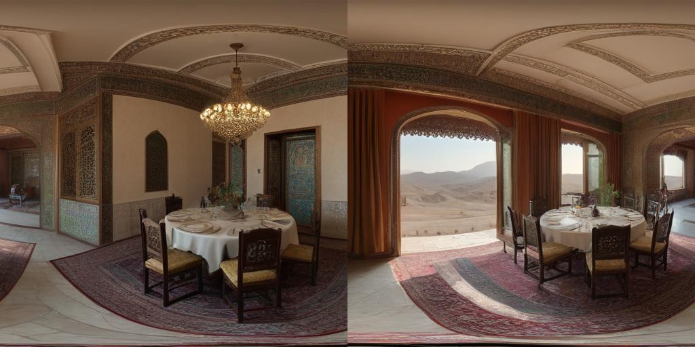
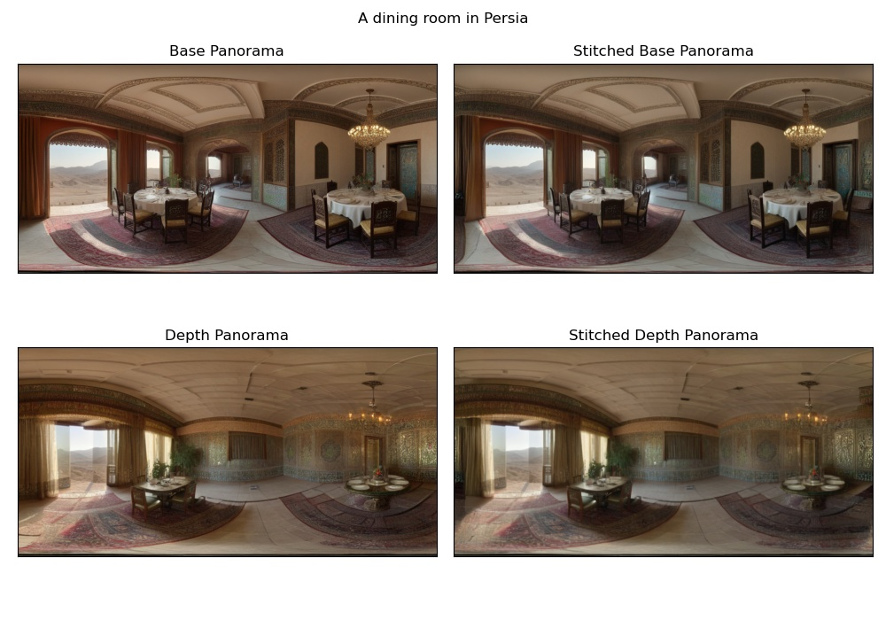
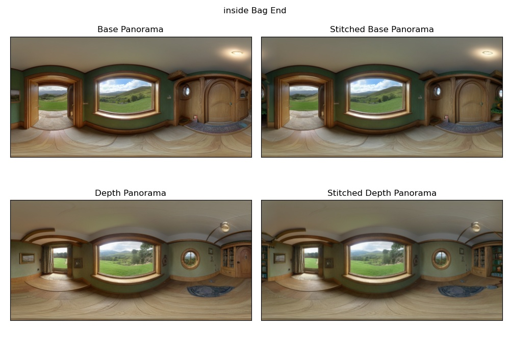
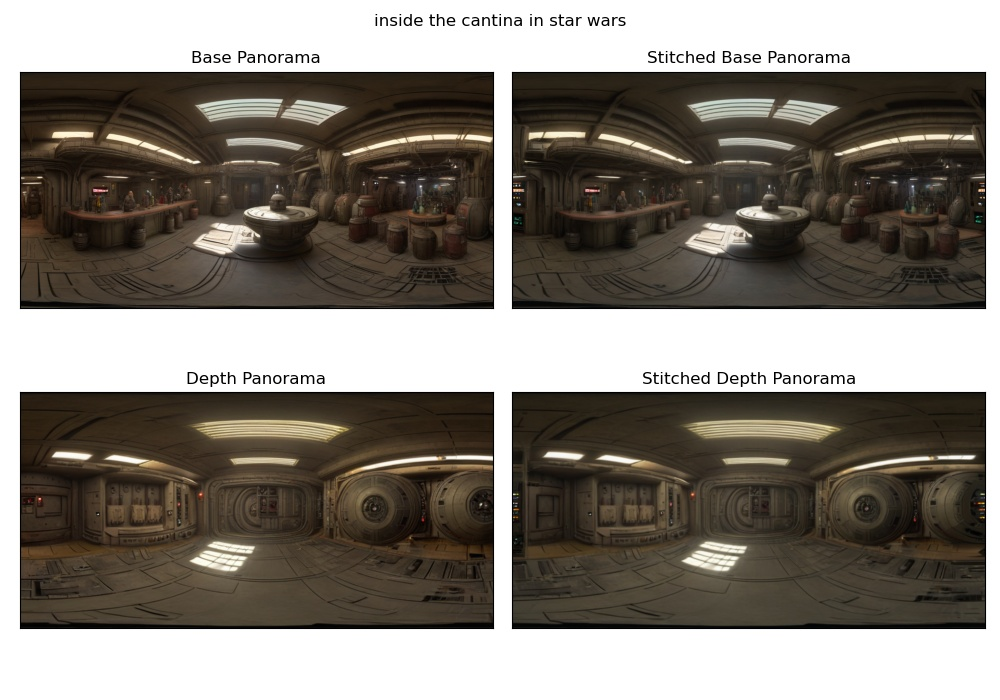
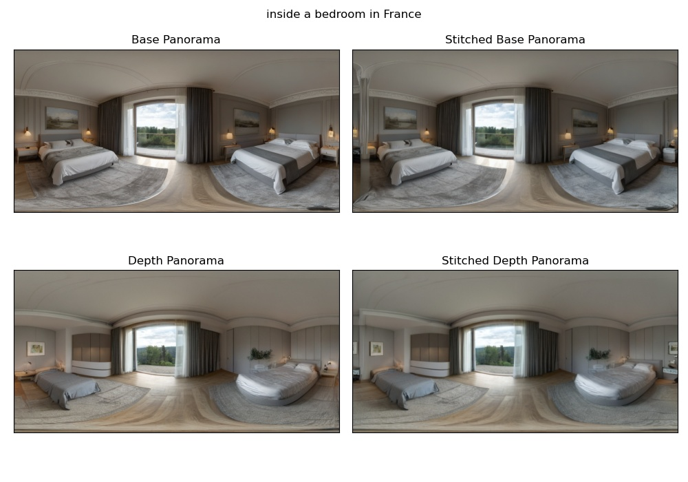

# 360-Panorama Generation with Stable Diffusion

## Introduction

This project demonstrates the generation of text-controlled 360-degree panoramas using Stable Diffusion. I have implemented seam-tiling to achieve coherent panoramas and also experimented with depth conditioning using a ControlNet. This README compares the results of panoramas with and without depth conditioning and seam-tiling.

<figure style="text-align: center;">
    
    <figcaption>A non coherent panorama with inconsistent seams</figcaption>
</figure>

<figure style="text-align: center;">
    
    <figcaption>A coherent panorama: The right and left ends of a coherent panorama match seamlessly.</figcaption>
</figure>

## Requirements

To set up this project, run the following commands:
```
pip install diffusers transformers accelerate safetensors huggingface_hub
git clone https://github.com/replicate/cog-sdxl cog_sdxl
```

## Generating a Prompt Conditioned Panorama

For generating 360-degree panoramas, I utilized the LoRA weights from [this model](https://huggingface.co/jbilcke-hf/sdxl-panorama). This is an XL Stable diffusion model that is tuned to generate 360 panorama images when referred to the T0k token. 

## Seam Correction

Initially, the seams of these panoramas were not coherent. To address this, I rolled the panorama by half its width, placing the incoherent transition in the centre. Then, by masking and inpainting, the center using XL Stable Diffusion, a coherent panorama was achieved.

<figure style="text-align: center;">
    
    <figcaption>A rolled image. The centre has an inconsistent transition, which is fixed using image inpainting. </figcaption>
</figure>


## Generating a Prompt and Depth Conditioned Panorama

For depth-conditioned panoramas, I used the [ControlNet pipeline](https://huggingface.co/docs/diffusers/api/pipelines/controlnet_sdxl). Similar to the previous method, I corrected the non-coherent seams through rolling and inpainting.

## Results

I have tested this methodology with the following prompts:

1. 'A dining room in Persia'
2. 'Inside Bag End'
3. 'Inside the cantina in Star Wars'
4. 'Inside a bedroom in France'
5. 'Inside a medieval prison'

Below are the results for each prompt:







## Usage of Code

To run the code, execute the following command:
```
python3 main.py
```


`main.py` contains the prompts, which can be edited as needed.

- `part1.py`: Contains `create_pano` function to generate panoramas using a prompt.
- `part2.py`: Contains `create_pano_depth` function for generating panoramas using prompt and depth information.
- `cleaner.py`: Contains `clean_pano` function for seam-stitching.

## Rendering Panoramas
The generated images are stored in the `images/` directory. Use images from `images/raw/` to render panoramas at [360 Panorama Web Viewer](https://renderstuff.com/tools/360-panorama-web-viewer/).

The following are the (prompt only) coherent panoramas that can be rendered in the Web viewer
1. [Dining Room in Persia](https://github.com/nirajmahajan/Depth-Controlled-Spherical-Panorama-Generation/blob/main/images/raw/prompt0/Prompt0_cleaned_non_depth_pano.jpg)
2. [Inside Bag End](https://github.com/nirajmahajan/Depth-Controlled-Spherical-Panorama-Generation/blob/main/images/raw/prompt1/Prompt1_cleaned_non_depth_pano.jpg)
3. [Inside the Cantina Star Wars](https://github.com/nirajmahajan/Depth-Controlled-Spherical-Panorama-Generation/blob/main/images/raw/prompt2/Prompt2_cleaned_non_depth_pano.jpg)
4. [Inside a bedroom in France](https://github.com/nirajmahajan/Depth-Controlled-Spherical-Panorama-Generation/blob/main/images/raw/prompt3/Prompt3_cleaned_non_depth_pano.jpg)
5. [Inside a medieval Prison](https://github.com/nirajmahajan/Depth-Controlled-Spherical-Panorama-Generation/blob/main/images/raw/prompt4/Prompt4_cleaned_non_depth_pano.jpg)

The following are the depth-conditioned panoramas.
1. [Dining Room in Persia](https://github.com/nirajmahajan/Depth-Controlled-Spherical-Panorama-Generation/blob/main/images/raw/prompt0/Prompt0_cleaned_depth_pano.jpg)
2. [Inside Bag End](https://github.com/nirajmahajan/Depth-Controlled-Spherical-Panorama-Generation/blob/main/images/raw/prompt1/Prompt1_cleaned_depth_pano.jpg)
3. [Inside the Cantina Star Wars](https://github.com/nirajmahajan/Depth-Controlled-Spherical-Panorama-Generation/blob/main/images/raw/prompt2/Prompt2_cleaned_depth_pano.jpg)
4. [Inside a bedroom in France](https://github.com/nirajmahajan/Depth-Controlled-Spherical-Panorama-Generation/blob/main/images/raw/prompt3/Prompt3_cleaned_depth_pano.jpg)
5. [Inside a medieval Prison](https://github.com/nirajmahajan/Depth-Controlled-Spherical-Panorama-Generation/blob/main/images/raw/prompt4/Prompt4_cleaned_depth_pano.jpg)


